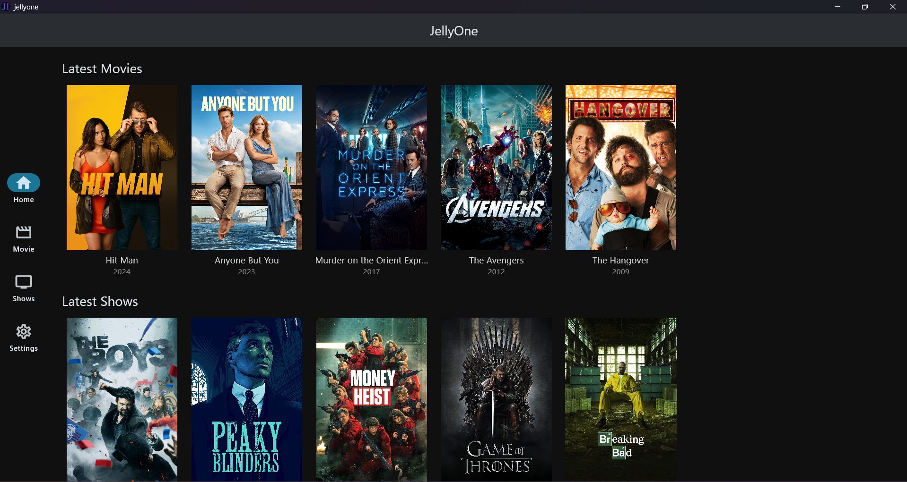
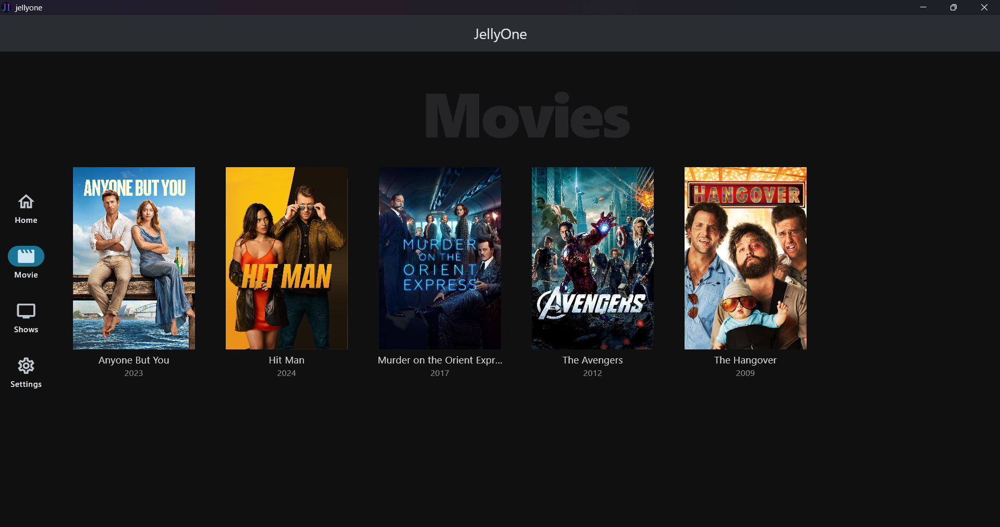
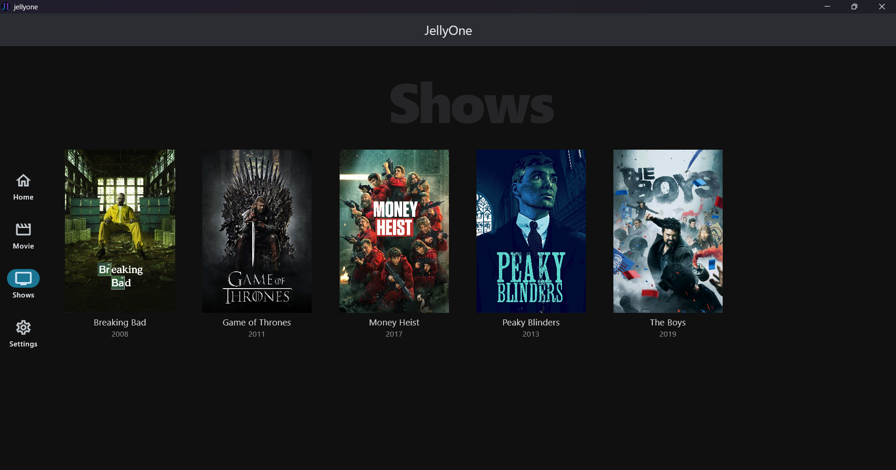

  

<h1 align="center"> :sparkles: JellyOne :sparkles: </h1>

  
  
  
  

JellyOne is a cross-platform desktop application focused on viewing local video content - Movies and Series. It is an alternative to <a href="https://github.com/jellyfin/jellyfin">Jellyfin</a> or <a href="https://www.plex.tv/">Plex</a> or <a href="https://github.com/zoriya/Kyoo">Kyoo</a> that does not use the client-server model to access media.

The aim is to develop an all-in-one app that can help manage and playing local media without opening file explorer or vlc. It scans the user-designated folders then calls TMDB API to fetch data about the media files. Currently, it only supports movies and shows, but the goal is to also support anime and music.

The UI is inspired by Jellyfin, but this project is not related to it.

# Screenshots :camera:

<table>
    <tr>
        
    </tr>
    <tr>
        <td></td>
        <td></td>
    </tr>
</table>

# Features :rocket:
Features include:
* Viewing locally available content
* Support for subtitles 
* Media related info is fetched from TMDB
* Caching content locally

# Download :arrow_down:

Get the app from the [releases page](https://github.com/mgautam07/jellyone/releases).

# Contributing :handshake:
Contributions are welcome!

# Disclaimer :exclamation:
This application does not promote piracy and it is also not affiliated to Jellyfin.